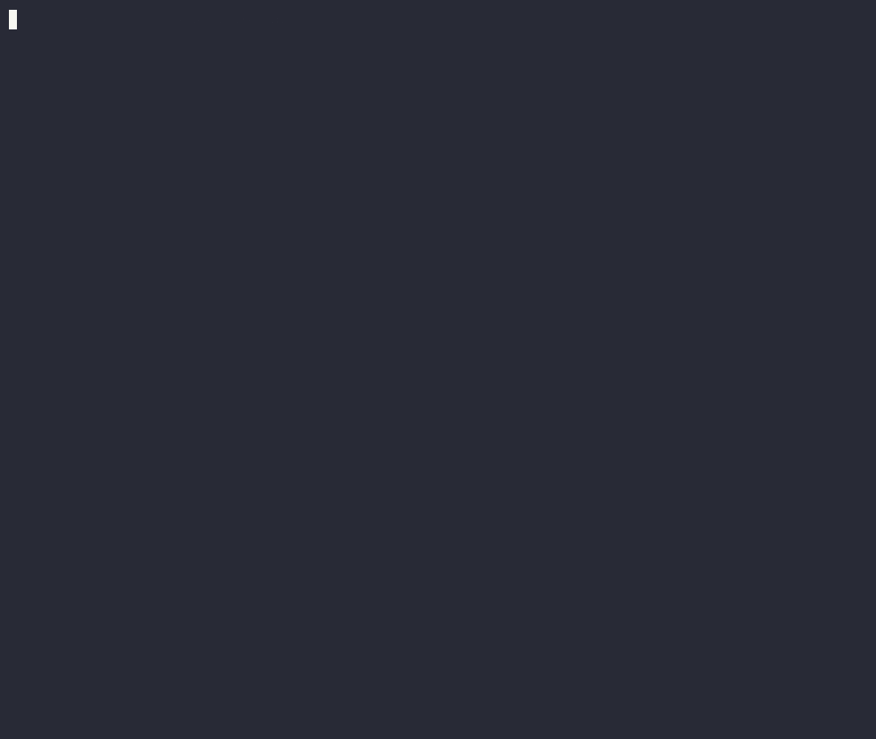

# LocalHarness

[](https://github.com/ahwurm/localharness/stargazers) [](LICENSE)

**Run AI agents on the models you already run locally.**

LocalHarness is the *agent layer* on top of your inference engine: vLLM, Ollama, LM Studio, or llama.cpp. It doesn't serve models. It gives the model you already serve real agents, with tools, memory, and deny-first permissions, all defined in YAML instead of Python.

It's model-agnostic. Point it at any OpenAI-compatible endpoint and the same agent runs. Agents are hierarchical: an orchestrator routes work to subagents, each with its own fresh context, tools, and memory.

The bet: the harness, not the model, is where most of the capability lives. The same model can swing tens of benchmark points depending on the harness around it.

Three things it does that are hard to find anywhere else:

- **Read documents bigger than the context window — losslessly.** Every section is actually read, never truncated, and every number in the answer traces back to the source text it came from. Built for long filings, contracts, and reports, on hardware you control.
- **Structural defense against prompt injection.** Untrusted web content can never share an agent with host-mutating tools like bash, write, or edit. The boundary is enforced in the agent topology and fails closed — not left to the model to refuse.
- **Memory that consolidates while idle.** Lessons auto-capture from real failure→recovery moments at zero extra model calls; recurring ones are promoted into the prompt during idle "sleep" passes; superseded facts are never deleted, and search routes through a gist/schema hierarchy — gists route the search, leaf records anchor the answer. All SQLite: no vector DB, no second resident model.
- **Sittings that remember each other.** Every run records a session; on close it gets one topical summary line (what you asked, or the error it resolved) — derived from events, zero model calls. The next sitting opens with the recent timeline already in its prompt (relative times, newest first, hard-capped at 8 lines) and can answer "what did we do last time?" without a single lookup.
- **A write gate that predicts.** Per-tool statistical priors — computed in pure SQL, zero model calls — score every tool outcome against that tool's own history. A normally-reliable tool that suddenly errors becomes a captured memory, and a user correction ("no, I meant…") writes a quarantined, reversible one; a failure the tool's history already expected stops being news. Each of these lands *below* the prompt's visibility line — captured and searchable, but not steering the agent until an idle consolidation pass confirms it, with one config lever to revert to motif-only capture.



> `localharness init` auto-detects your running endpoint (here, vLLM serving Qwen) and probes its tool-calling. Then `localharness start` is zero-config: it creates the orchestrator — a general-purpose root agent — and drops you straight into the REPL. Ask it a real question and watch the agent work — here it chains `web_search` → `web_fetch` across several iterations to research the best open-source model for a 128 GB machine, the tool-call loop visible the whole way.

## Why local

Frontier coding agents are great when you're driving them. But metering and rate limits make them an awkward fit for the recurring jobs you'd actually want an agent to *own*: the nightly report, the scheduled cleanup, the watch-and-react task. LocalHarness keeps the Claude Code / OpenCode workflow you already know, pointed at a model running on hardware you control.

- **No metering.** A job that fires every hour runs on hardware you already own, with no per-token bill.
- **Your data stays put.** Code, files, and prompts never leave the machine.
- **Always on.** No quota or rate caps to budget around for unattended runs.
- **Familiar.** Same agent, tool, and permission model as the cloud tools, just local.

A frontier agent like Claude Code is still the easy way to set the harness up and compose a bespoke subagent for a task. The split that works: frontier to design, local to run.

**Migrating existing headless work?** [LocalShift](https://github.com/ahwurm/localshift) is the companion project. Point Claude Code at a cron job, skill, or bare prompt and it builds a per-workload quality eval, proves the local model is good enough (or honestly says keep-frontier), then cuts the job over to run claude-free on LocalHarness.

## Features

- **YAML-defined agents** — add an agent, division, or tool policy without writing Python
- **Event-bus core** — components communicate via a typed event stream, persisted as append-only JSONL per agent
- **Memory that learns from use** — per-agent SQLite memory with an automatic write gate (lessons captured from failure→recovery signals, zero extra model calls), activation-ranked recall in pure SQL, cancellable idle consolidation, and a persisted gist/schema hierarchy over document analyses; conflicting facts supersede, never overwrite
- **Deny-first permissions** — policies inherit down the hierarchy and can only narrow
- **Tool-call fallback** — native function calling where the model supports it, XML/Hermes fallback where it doesn't
- **MCP support** — connect Model Context Protocol servers and expose their tools to agents
- **Built-in tools** — read, write, edit, glob, grep, bash, python, web search/fetch, and subagent delegation
- **Benchmark suite** — scenario corpus in `bench/` for measuring harness changes against your own model
- **Autoresearch loop** — propose → gate → promote mutation archive for harness self-improvement experiments
- **Pluggable channels** — CLI today; Discord adapter in development

## How it compares

LocalHarness is an *agent layer* — not an inference engine, and not a cloud SaaS. It sits on top of whatever serves your model and gives that model agents, tools, memory, and permissions.

| | What it is | LocalHarness relationship |
|---|---|---|
| **Ollama / vLLM / LM Studio / llama.cpp** | Inference engines — they *serve* a model over an API | LocalHarness runs on top; point it at their endpoint |
| **Cloud agent frameworks** (hosted assistants / SaaS) | Agents that run against a vendor's metered API | Same agent / tool / permission model, but against a model on *your* hardware — no metering, data stays local |
| **Agent libraries** (write-your-own in Python) | Code-first SDKs for building agents | Config-first: agents, divisions, and permissions in YAML, no Python required |

If you already serve a model with Ollama or vLLM and want to run real agents against it — with tools, isolated memory, and deny-first permissions — that's the gap LocalHarness fills.

## Requirements

- Python ≥ 3.12 and [uv](https://docs.astral.sh/uv/)
- A local LLM server with an OpenAI-compatible API (vLLM, Ollama, LM Studio, or llama.cpp)

## Quick start

```bash
git clone https://github.com/ahwurm/localharness.git
cd localharness
uv sync

uv run localharness init    # probes vLLM :8081/:8000, Ollama :11434, LM Studio :1234, llama.cpp :8080
uv run localharness start   # interactive session
```

`init` detects your endpoint and models, probes tool-calling capability, and writes `~/.localharness/config.yaml`. No server running? `init` walks you through setup: pick your hardware (reference architecture), it installs vLLM, downloads the reference model, and launches the server — then `start` just works. Inside the REPL, `/model` lists served + downloaded models and swaps between them. Non-standard setup: `localharness init --endpoint http://host:port/v1`. A repo-local `.localharness/` directory overlays the global config.

> Got it running? If LocalHarness saved you an API bill, a [star](https://github.com/ahwurm/localharness/stargazers) helps other local-LLM folks find it.

### Running the harness on a different machine than the model

The harness and the model server are separate processes talking HTTP — they don't need to
share a machine. A laptop can run agents against a model served elsewhere on your network:
`localharness init --endpoint http://<server-ip>:8000/v1`. Two things to know:

- **Tools run where the harness runs.** bash/file tools execute on the client machine; the
  model server only sees text in, text out. Pointing a harness at a server doesn't let
  anyone act on the server.
- **Secure the endpoint.** Inference servers ship with no authentication by default. On a
  network with untrusted devices, start the server with an API key (e.g. vLLM `--api-key`)
  and set `provider.api_key` to match; for access from outside your LAN use a private
  overlay network (Tailscale/WireGuard). Never port-forward a bare endpoint to the internet.

## CLI

| Command | Purpose |
|---------|---------|
| `init` | Detect endpoint/model, write config |
| `start` | Interactive session |
| `doctor` | Diagnose config/endpoint issues |
| `validate` | Validate agent/org YAML |
| `agent …` | Manage agent definitions |
| `bench …` | Run the scenario benchmark |
| `components …` | Autoresearch component registry |
| `autoresearch …` | Run the self-improvement loop |
| `experiment …` | Gated experiment runs |
| `propose` | Propose a harness mutation |

## Testing

```bash
uv sync --extra dev
uv run pytest                                          # hermetic — no model server needed
LOCALHARNESS_LIVE_VLLM=1 uv run pytest -m live_vllm    # opt-in tests against a live endpoint
```

Some bench scenarios read fixture files from `/tmp/bench_fixtures/`. pytest stages these automatically from `tests/fixtures/bench/`; before standalone `bench run` invocations, run the test suite once or copy that directory there yourself.

## Reference architectures

LocalHarness is developed against two maintainer-tested hardware targets. Both must meet
the practicality bar — **64k of KV-cache headroom and ≥9.5 tok/s single-stream** — with
the newest Qwen model that fits it:

| | Hardware | Model / Runtime | Status |
|---|---|---|---|
| [A: DGX Spark](docs/reference-architectures/dgx-spark.md) | GB10, 128 GB unified | Qwen3.6-27B NVFP4 / vLLM, 64k ctx, 9.5 tok/s | TESTED |
| [B: Base Mac mini](docs/reference-architectures/mac-mini.md) | M4, 16 GB unified | Qwen3.5-9B 4-bit / vLLM (vllm-metal), 64k ctx | PROPOSED |

Start at [docs/reference-architectures/](docs/reference-architectures/README.md). Per-hardware setup and tuning notes — timeouts, context budgets, runtime parity — are in [gaps.md](docs/reference-architectures/gaps.md).

## Documentation

- [docs/reference-architectures/](docs/reference-architectures/README.md) — supported hardware targets and setup notes
- [docs/specs/](docs/specs/) — component specs

## Status

Early stage (v0.8.0, pre-1.0). Interfaces and config schema may change without notice.

## License

[MIT](LICENSE)
