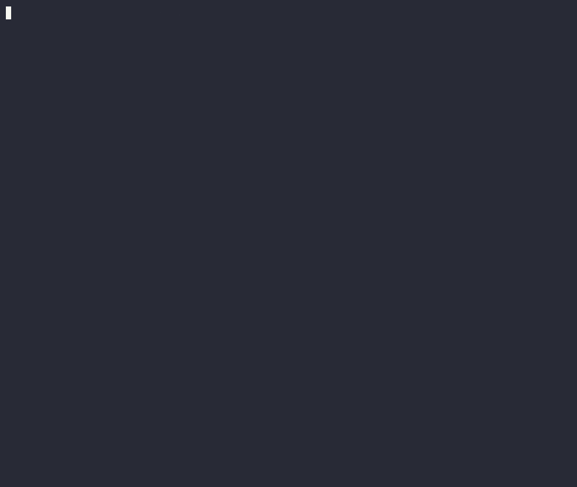

# LocalHarness

[](https://github.com/ahwurm/localharness/stargazers) [](LICENSE)

**Run AI agents on the models you already run locally.**

LocalHarness does not serve models. It sits on top of the one you already serve — vLLM, llama.cpp, Ollama, or LM Studio — and gives it real agents: tools, memory, and permissions, written in YAML instead of Python.

Point it at any OpenAI-compatible endpoint and the same agent runs. One main agent reads your task and hands pieces to helpers, each working in its own fresh window with only the tools you allowed it.

The bet behind the project: most of what makes an agent good lives in the harness, not the model. The same model can swing tens of benchmark points depending on what is built around it.

Five things it does that are hard to find anywhere else:

- **It reads documents bigger than its own memory.** A long filing or contract is read in sections, start to finish — nothing is skipped and nothing is skimmed — and every number in the answer points back to the line it came from.
- **A web page cannot talk it into running commands.** Anything fetched off the internet is handled by a helper that has no power to run commands or change files. That wall is built into the structure, so it holds even when the model is fooled.
- **It remembers what went wrong, and files it while idle.** When something fails and then gets fixed, that lesson is saved on its own, with no extra calls to the model. Lessons that keep recurring are promoted into the prompt during idle time. Old facts are never deleted, only superseded. It all lives in SQLite — no vector database, no second model sitting in memory.
- **Each session remembers the last one.** Every run closes with a one-line summary of what you asked, or of the error it resolved, written from the record rather than by the model. The next session opens already knowing what you did last time, so "what did we do yesterday?" gets a real answer with no lookup.
- **It learns which failures are worth remembering.** Each tool builds up a picture of how it normally behaves, so a reliable tool suddenly breaking is news and a flaky one failing again is not. A correction from you ("no, I meant…") is saved separately and can be undone. New lessons stay out of sight until an idle pass confirms them.



> `localharness init` finds the server you already have running (here, vLLM serving Qwen) and checks whether its model can call tools. Then `localharness start` needs no setup: it builds the main agent and drops you at a prompt. Ask a real question and watch it work — here it searches the web, fetches pages, and keeps going for several rounds to find the best open model for a 128 GB machine, every tool call visible as it happens.

## Why run agents locally?

Frontier coding agents are great when you're driving them. But metering and rate limits make them an awkward fit for the recurring jobs you'd actually want an agent to *own*: the nightly report, the scheduled cleanup, the watch-and-react task. LocalHarness keeps the Claude Code / OpenCode workflow you already know, pointed at a model running on hardware you control.

- **No metering.** A job that fires every hour runs on hardware you already own, with no per-token bill.
- **Your data stays put.** Code, files, and prompts never leave the machine.
- **Always on.** No quota or rate caps to budget around for unattended runs.
- **Familiar.** Same agent, tool, and permission model as the cloud tools, just local.

**The gate asks about your workspace, not about your work.** From v0.14.1 the default mode is `auto`: the first time a session opens a folder this machine has never worked in, LocalHarness asks once whether you trust it — a project with earlier sessions behind it is recognized and never asked, and the answer, once given, is recorded forever — and after that everything runs except a short blacklist: a delete or a recursive `chmod`/`chown` aimed outside the project, `git push --force`/`--delete`, `git reset --hard`, `git clean -f`, `sudo`/`su`, `curl … | sh`, `dd`/`mkfs`/`shred`, writes to your secret stores or the system directories, and writes to `.git/` or your config files under `.localharness/`. Nothing else interrupts you — not docker, not interpreters, not subagents, not MCP tools, not writes elsewhere. Decline the trust question and the session runs `guarded`, the v0.14.0 behavior: ask once about each new thing, remember the answer. A session with nobody to ask and no record runs `guarded` too.

**And nothing on that blacklist stops the agent.** From v0.14.2 a blacklisted call in `auto` is parked as a pending decision instead of being put to you as a prompt: the model is told to carry on without that step and to name the pending number in its answer, and the turn keeps running. You answer whenever you get back. `/pending` lists what is waiting, `/approve N` runs one and `/deny N` drops one, with the oldest as the default; in the terminal `ctrl+y` and `ctrl+n` answer the oldest, and in Discord the notice carries ✅ and ❌. An approval covers that one call with those exact arguments, once, and is not remembered. `guarded` and `trusted` still ask with a blocking prompt, because that is what they are for.

**One setting a cron job still needs.** A run with nobody to answer a question refuses the call instead of allowing it — including the trust question — so a nightly or cron job needs `permissions.mode: unattended` written in its config, which restores the pre-v0.14 behavior of never asking anything. It is config-only on purpose; see [SECURITY.md](SECURITY.md).

A frontier agent like Claude Code is still the easy way to set the harness up and compose a bespoke subagent for a task. The split that works: frontier to design, local to run.

**Migrating existing headless work?** [LocalShift](https://github.com/ahwurm/localshift) is the companion project. Point Claude Code at a cron job, skill, or bare prompt and it builds a per-workload quality eval, proves the local model is good enough (or honestly says keep-frontier), then cuts the job over to run claude-free on LocalHarness.

## Features

- **YAML-defined agents** — add an agent, division, or tool policy without writing Python
- **Event-bus core** — components communicate via a typed event stream, persisted as append-only JSONL per agent
- **Memory that learns from use** — each agent keeps its own SQLite memory. Lessons are captured on their own when something fails and then gets fixed, with no extra calls to the model. Recall is ranked by what actually gets used, in plain SQL. Filing happens during idle time and can be cancelled. A fact that changes is superseded, never overwritten
- **Workspace layers** — a `.localharness/` folder in a project layers its own agents and config over the machine-wide one (nearest wins, deny patterns union so a project can never widen them); `localharness config show` names the file behind every effective key, and `doctor` names both layers and every key the project overrides
- **Per-project memory** — where a workspace applies, memory, sessions, history, and the audit log live with the project, so many projects on one machine stop pouring their lessons into each other's context; `/memory promote` moves a single fact to the global store, deliberately
- **Deny-first permissions** — one deterministic gate in front of every tool call; policies inherit down the hierarchy and can only narrow
- **Tool-call fallback** — native function calling where the model supports it, XML/Hermes fallback where it doesn't
- **MCP support** — connect Model Context Protocol servers and expose their tools to agents
- **Built-in tools** — read, write, edit, glob, grep, bash, python, web search/fetch, and subagent delegation
- **Benchmark suite** — scenario corpus in `bench/` for measuring harness changes against your own model
- **Autoresearch loop** — propose → gate → promote mutation archive for harness self-improvement experiments
- **Pluggable channels** — terminal by default, or `localharness start --channel discord` to drive a session from Discord (needs the `dispatch` extra, `uv sync --extra dispatch`, plus `LOCALHARNESS_DISCORD_TOKEN` and `LOCALHARNESS_DISCORD_ALLOW`), or `localharness web` to drive one from a phone on your own private network — home-screen install, a pairing QR so you never type the token, and a lock-screen notification when a long turn finishes or the permission gate needs you (needs the `web` extra; ships a bare reference page, **not** a finished chat app — see [docs/web.md](docs/web.md))

**Answering a permission prompt in Discord.** When the gate needs a human, the bot posts a
🛑 **Permission needed** message and reacts to it with your options: **✅ allow once**,
**♾️ always allow this in this workspace** (an "always" is written to `grants.yaml` and holds in
the terminal and Zed too), and **❌ no, this once**. In the default `auto` mode the only
question that blocks is the workspace trust question, the first time you use a folder. A blacklisted call is
posted as a pending decision instead, with ✅ (run it), ❌ (skip it) and the `/approve N` spelling in the text;
answering it resolves the call and holds nothing up, and it does not expire. `♾️` appears in `guarded` and
`trusted`, where answers are remembered. Only a user on `LOCALHARNESS_DISCORD_ALLOW` can answer. A blocking
question in those two modes does expire: if nobody reacts before `permissions.ask.timeout_s`, the call is denied
and the message is edited to say so. React after that and nothing happens; ask again instead.

## How it compares

LocalHarness is an *agent layer* — not an inference engine, and not a cloud SaaS. It sits on top of whatever serves your model and gives that model agents, tools, memory, and permissions.

| | What it is | LocalHarness relationship |
|---|---|---|
| **Ollama / vLLM / LM Studio / llama.cpp** | Inference engines — they *serve* a model over an API | LocalHarness runs on top; point it at their endpoint |
| **Cloud agent frameworks** (hosted assistants / SaaS) | Agents that run against a vendor's metered API | Same agent / tool / permission model, but against a model on *your* hardware — no metering, data stays local |
| **Agent libraries** (write-your-own in Python) | Code-first SDKs for building agents | Config-first: agents, divisions, and permissions in YAML, no Python required |

If you already serve a model with Ollama or vLLM and want to run real agents against it — with tools, isolated memory, and deny-first permissions — that's the gap LocalHarness fills.

## Supported runtimes

Every backend is reached over one OpenAI-compatible client, so the *request* path is
provider-agnostic. What differs per runtime is **lifecycle** (whether the harness can start and
stop the server itself), **introspection** (exact token counting, context-window discovery), and
how much has been validated on real hardware. All four also work as a plain
**attach** target — point `init` at an already-running endpoint. Setup pages:
[llama.cpp](docs/runtimes/llamacpp.md) · [Ollama](docs/runtimes/ollama.md) ·
[LM Studio](docs/runtimes/lmstudio.md) · vLLM (see [reference architectures](docs/reference-architectures/README.md)).

| Runtime | Harness-managed lifecycle | Model tree / switch | Tool-calling | Token counting | Context window | Live-validated |
|---|---|---|---|---|---|---|
| **vLLM** | ✅ docker / binary | ✅ | ✅ native | ✅ exact | ✅ `max_model_len` | ✅ reference + bench |
| **llama.cpp** | ✅ spawns `llama-server` | ✅ cross-framework | ✅ XML / Hermes | ✅ exact (`/tokenize`) | ✅ `/props` `n_ctx` | ✅ incl. live heavy-swap |
| **Ollama** | ✅ spawns + owns `ollama serve` | ✅ | ✅ native | ✅ exact (GGUF)¹ | ✅ `/api/ps`² | ✅ CPU round-trip |
| **LM Studio** | ✅ drives headless `lms` | ✅ | ✅ native | ✅ exact (GGUF)¹ | ✅ `loaded_context_length`² | ✅ CPU round-trip |

✅ validated — footnotes note setup caveats, not gaps:

1. **Token counting** is exact for every runtime — whole-request exact, not just content. vLLM
   applies its chat template server-side (`/tokenize` messages-mode) and llama.cpp renders it via
   `/apply-template` before `/tokenize`, so message counts — *including the rendered tools block* —
   equal the real call's `usage.prompt_tokens` to the token (verified live on both). Ollama and
   LM Studio serve no tokenize endpoint, so the harness loads the served model's *own* GGUF vocab +
   chat template in-process (`llama-cpp-python` vocab-only — the `exact-tokenizer` extra) and counts
   to the token — verified equal to each server's own count (message structure exact; the tools
   block is not rendered on these two). Older vLLM/llama.cpp builds without messages-mode /
   `/apply-template` keep exact content counts and estimate message overhead, disclosed at start;
   without the extra (or with no local model files), Ollama/LM Studio fall back to a labeled
   approximate estimate.
2. **Context window** is read at server level for vLLM (`max_model_len`) and llama.cpp (`/props`),
   and from the *loaded* model for Ollama (`/api/ps` `context_length`) and LM Studio
   (`loaded_context_length`) — the latter two are known once the model is resident (the harness
   warm-loads it) and fall back to config, disclosed, before then. Never a silent guess; the served
   window, not a model ceiling that would over-report and 400 mid-session.

*Live-validated* means a real end-to-end run on the [DGX Spark](docs/reference-architectures/dgx-spark.md)
reference machine (detect → serve → tool-call → verified stop). Recorded **bench** runs currently
exist for vLLM only; the other runtimes ship opt-in `bench.yaml` entries you run against your own
model. Per-runtime live markers: `LOCALHARNESS_LIVE_{VLLM,OLLAMA,LLAMACPP,LMSTUDIO}=1 uv run pytest -m live_<name>`.

## Requirements

- Python ≥ 3.12 and [uv](https://docs.astral.sh/uv/)
- A local LLM server with an OpenAI-compatible API (vLLM, Ollama, LM Studio, or llama.cpp)
- On Windows: [Git for Windows](https://git-scm.com/download/win) — `bash_exec` runs under
  git-bash (see [Platform support](#platform-support))

## Quick start

```bash
git clone https://github.com/ahwurm/localharness.git
cd localharness
uv sync

uv run localharness init    # probes vLLM :8081/:8000, Ollama :11434, LM Studio :1234, llama.cpp :8080
uv run localharness start   # interactive session
```

`init` detects your endpoint and models, probes tool-calling capability, and writes `~/.localharness/config.yaml`. No server running? `init` walks you through setup: pick your hardware (reference architecture) and it provisions the local server (pulling the vLLM container where Docker is available) — `start` then reuses it. Inside the REPL, `/model` lists served + downloaded models and swaps between them; `localharness start --model <name>` picks one for a single session without touching config, and `--list-models` lists without starting a session. `localharness model --download <repo_id>` (optionally `--file <name>` for one GGUF quant out of a multi-quant repo) pulls a model from Hugging Face ahead of time. Non-standard setup: `localharness init --endpoint http://host:port/v1`. To give one project its own agents, config, and memory, run `localharness init --workspace` inside it — the resulting `.localharness/` directory is discovered by walking up from wherever you start, and layers over the global config.

> Got it running? If LocalHarness saved you an API bill, a [star](https://github.com/ahwurm/localharness/stargazers) helps other local-LLM folks find it.

### Running the harness on a different machine than the model

The harness and the model server are separate processes talking HTTP — they don't need to
share a machine. A laptop can run agents against a model served elsewhere on your network:
`localharness init --endpoint http://<server-ip>:8000/v1`. Two things to know:

- **Tools run where the harness runs.** bash/file tools execute on the client machine; the
  model server only sees text in, text out. Pointing a harness at a server doesn't let
  anyone act on the server.
- **Secure the endpoint.** Inference servers ship with no authentication by default. On a
  network with untrusted devices, start the server with an API key (e.g. vLLM `--api-key`)
  and set `provider.api_key` to match; for access from outside your LAN use a private
  overlay network (Tailscale/WireGuard). Never port-forward a bare endpoint to the internet.

## Platform support

Tools run where the harness runs, and `bash_exec` always launches a real bash — never
`/bin/sh`, never WSL. What differs per platform is how that bash is found.

### Linux

- `bash_exec` runs `bash -c` with the bash on `PATH` (falling back to `/bin/bash`), so brace
  expansion, `[[ ]]` and arrays behave as written even where `/bin/sh` is dash.
- CI runs on Ubuntu; the Linux path is the one exercised by every test run and the
  [DGX Spark](docs/reference-architectures/dgx-spark.md) live validation. The `doctor` GPU
  checks are Linux-only.

### Windows

- **Native, no WSL required.** Install [Git for Windows](https://git-scm.com/download/win).
  The harness looks for `Git\bin\bash.exe` under `%ProgramFiles%`, `%ProgramFiles(x86)%` and
  `%LocalAppData%\Programs`, and deliberately skips the WSL launchers (`System32\bash.exe` and
  the Store alias under `WindowsApps`): without a distro they print UTF-16 garbage, and with
  one they act on a different filesystem than the native file tools.
- It picks the `Git\bin\bash.exe` wrapper over `Git\usr\bin\bash.exe` on purpose: the wrapper
  puts `/usr/bin` on `PATH`, so coreutils (`mkdir`, `ls`, `cp`, …) resolve no matter which shell
  started the harness. `Git\usr\bin\bash.exe` launched directly inherits a PowerShell PATH with no
  coreutils on it. To use a different bash, set `LOCALHARNESS_BASH` to a wrapper-style executable.
- A `bash_exec` command that could not RUN is a tool error on every platform, and its output is
  forwarded to the model inside the error so it can react (e.g. `command not found`). That is
  exit 127 (not found), 126 (not executable), and abnormal termination — a signal on POSIX, an
  NTSTATUS crash code on Windows. 126/127 are the shell's convention rather than a reserved
  range, so a program that picks those codes for its own reasons is reported as a failure it
  did not have; that is the deliberate side to err on. A command that ran and returned any
  other non-zero code is an ordinary result with `exit code N` on the first line: `grep` with
  no match and `test -f` on a missing file are answers, not faults. A timeout kills the
  command's whole process tree (a job object on Windows, the process group on POSIX).
- Paths: the file tools accept Windows or POSIX paths, relative to the harness working directory.
  `/tmp/...` maps to `%TEMP%`, which is where git-bash mounts `/tmp`, so the file tools and
  `bash_exec` agree on one tree. Inside `bash_exec` commands, use forward slashes — bash strips
  backslashes as escapes.
- Running the model on another machine (e.g. a DGX over Tailscale) and the harness on a Windows
  laptop is a supported setup; see the previous section.

## CLI

| Command | Purpose |
|---------|---------|
| `init` | Detect endpoint/model, write config (`--workspace` scaffolds `./.localharness/` for one project instead) |
| `start` | Interactive session (`--model`/`-m` for a one-off session model, `--list-models` to list and exit; `--show-reasoning` streams the model's thinking as dim lines while it generates, `/reasoning` toggles it live — needs the server's reasoning parser) |
| `acp` | Run as an [Agent Client Protocol](https://agentclientprotocol.com) server so LocalHarness appears in Zed's agent panel — see [docs/zed.md](docs/zed.md) |
| `web` | Serve the session to a phone: a JSON event API plus a bare reference page (`--replay`/`--fixtures` build the UI with the model server down) — see [docs/web.md](docs/web.md) |
| `doctor` | Check Python, config, endpoint, model, context budget, token counting and directories; inside a project, name both config layers and the keys the project overrides |
| `config show` | Print the effective merged config and the file that set each key |
| `config migrate` | Fold new shipped security defaults into an existing config — also auto-applied on the first `start` after an upgrade (revision-stamped, additive, backed up) |
| `validate` | Validate agent/org YAML |
| `model` | List served/downloaded models, switch the persisted default, or `--download <repo_id>` (optionally `--file <name>`) a model from Hugging Face |
| `agent …` | Manage agent definitions |
| `bench …` | Run the scenario benchmark |
| `components …` | Autoresearch component registry |
| `autoresearch …` | Run the self-improvement loop |
| `experiment …` | Gated experiment runs |
| `propose` | Propose a harness mutation |

## Testing

```bash
uv sync --extra dev
uv run pytest                                          # hermetic — no model server needed
LOCALHARNESS_LIVE_VLLM=1 uv run pytest -m live_vllm    # opt-in tests against a live endpoint
```

Some bench scenarios read fixture files from `/tmp/bench_fixtures/`. Both `pytest` and `localharness bench` stage these automatically from `tests/fixtures/bench/`, so no manual copy step is needed from a repo checkout.

## Reference architectures

LocalHarness is developed against three reference hardware targets: one maintainer-tested and two proposed. All must meet
the practicality bar — **64k of KV-cache headroom and ≥9.5 tok/s single-stream**. Four
tested configs on architecture A (Qwen 3.8 / 3.6 and DeepSeek V4 Flash across llama.cpp
and vLLM); the current default:

| | Hardware | Model / Runtime | Status |
|---|---|---|---|
| [A: DGX Spark](docs/reference-architectures/dgx-spark.md) | GB10, 128 GB unified | Qwen3.8-27B UD-Q4 GGUF + MTP spec decode / llama.cpp, 64k ctx, 17–21 tok/s measured | TESTED |
| [B: Base Mac mini](docs/reference-architectures/mac-mini.md) | M4, 16 GB unified | Qwen3.5-9B 4-bit / vLLM (vllm-metal), 64k ctx | PROPOSED |

Start at [docs/reference-architectures/](docs/reference-architectures/README.md). Per-hardware setup and tuning notes — timeouts, context budgets, runtime parity — are in [gaps.md](docs/reference-architectures/gaps.md).

## Documentation

- [docs/zed.md](docs/zed.md) — **Use in Zed**: register `localharness acp` as an agent server, what the panel shows, and what it does not do yet
- [docs/web.md](docs/web.md) — **Use from a phone**: `localharness web`, what the bare reference page is and is not, how to build your own UI against the event API with the GPU cold, and a table of which channel to use for what
- [docs/reference-architectures/](docs/reference-architectures/README.md) — supported hardware targets and setup notes
- [docs/specs/](docs/specs/) — component specs

## Status

Early stage (v0.14.1, pre-1.0). Interfaces and config schema may change without notice.

## License

[MIT](LICENSE)
